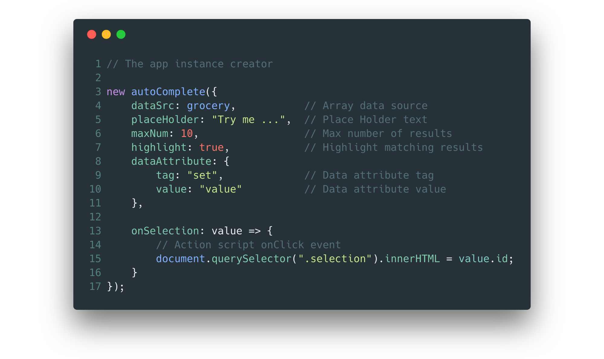
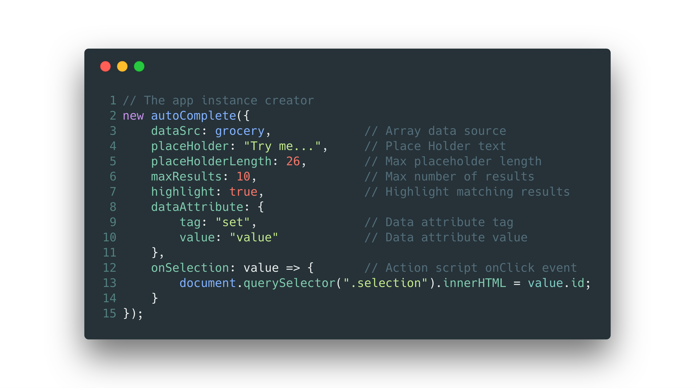

# autoComplete.js :sparkles:
[](https://opensource.org/licenses/Apache-2.0)
[](https://travis-ci.com/TarekRaafat/autoComplete.js)
[](https://badge.fury.io/gh/tarekraafat%2FautoComplete.js)
[](https://badge.fury.io/js/%40tarekraafat%2Fautocomplete.js)
[](https://www.jsdelivr.com/package/gh/TarekRaafat/autoComplete.js)
](https://img.shields.io/badge/Dependencies-0-blue.svg)
](https://img.shields.io/badge/Size-4%20KB-green.svg)
[](https://github.com/TarekRaafat/autoComplete.js)


[](http://www.tarekraafat.com/dev/projects/autoComplete/)

> Simple autocomplete pure vanilla Javascript library. <a href="http://www.tarekraafat.com/dev/projects/autoComplete/" target="_blank">Demo</a>

autoComplete.js is a simple pure vanilla Javascript library that's built for speed, high versatility and seamless integration with wide range of projects & systems.

## Features
- [x] Simple & Easy to use
- [x] Pure Vanilla Javascript
- [x] Zero Dependencies
- [x] Lightweight
- [x] Lightning Fast
- [x] Versatile
- [x] Customizable
- [x] First Class Error Reporting

[](https://codepen.io/tarekraafat/pen/rQopdW)
----

## Get Started

### Clone:

* Clone autoComplete.js to your local machine using `https://github.com/TarekRaafat/autoComplete.js.git`

<br>

### Setup:

1. Install Dependencies
```shell
$ npm i
```
2. Development live server
```shell
$ npm start
```
3. Build Production Package
```shell
$ npm run build
```

<br>

### Installation: 

* jsDelivr CDN (<a href="https://www.jsdelivr.com/package/gh/TarekRaafat/autoComplete.js?tab=collection">Link</a>)

`CSS`
```html
<head>

<link rel="stylesheet" href="https://cdn.jsdelivr.net/gh/TarekRaafat/autoComplete.js@1.3.1/dist/css/autoComplete.min.css">

</head>
```
`JS`
```html
<body>
	
<script src="https://cdn.jsdelivr.net/gh/TarekRaafat/autoComplete.js@1.3.1/dist/js/autoComplete.min.js"></script>

</body>
```

* HTML Local load
  
```html
<script src="./autoComplete.js"></script>
```

* HTML Local load - ES6 module `(Use with Import)`
  
```html
<script src="./index.js" type="module"></script>
```

* Import module ES6

```js
import autoComplete from "./autoComplete";
```

* npm install `(Node Package Manager)`

https://www.npmjs.com/package/@tarekraafat/autocomplete.js

```shell
$ npm i @tarekraafat/autocomplete.js
```

* Node.js

```js
const autoComplete = require("@tarekraafat/autocomplete.js/dist/js/autoComplete");
```

<br>

### How to use:

> HTML file
1. Assign id="autoComplete" to the input filed

```html
<input id="autoComplete" type="text">
```
> JS file

2. Create new instance of autoComplete engine
```js
// The app instance creator
new autoComplete({
	dataSrc: grocery,		  // Array data source
	placeHolder: "Try me...",  	  // Place Holder text
	placeHolderLength: 26,		  // Max placeholder length
	maxResults: 10,		    	  // Max number of results
	highlight: true,	  	  // Highlight matching results	
	dataAttribute: {
		tag: "set",	    	  // Data attribute tag
		value: "value"	    	  // Data attribute value
	},
	onSelection: value => {    	  // Action script onClick event
		document.querySelector(".selection").innerHTML = value.id;
	}
});
```
3. That's it, you're ready to go!

----

Example
--------

  - Working example [Demo]


  - Try it on [CodePen](https://codepen.io/tarekraafat/pen/rQopdW)

[Demo]: http://www.tarekraafat.com/dev/projects/autoComplete/

  - Download [Demo] files locally from <a href="./dist" target="_blank">`/dist`</a> folder

----

Support
----------------

For general questions about autoComplete.js, tweet at [@TarekRaafat].

For technical questions, you should post a question on [Stack Overflow] and tag 
it with [autoComplete.js][so tag].

<!-- section links -->

[Stack Overflow]: http://stackoverflow.com/
[@TarekRaafat]: https://twitter.com/TarekRaafat
[so tag]: http://stackoverflow.com/questions/tagged/autoComplete.js

----

## Browsers Support

| [](http://godban.github.io/browsers-support-badges/)</br>IE / Edge | [](http://godban.github.io/browsers-support-badges/)</br>Firefox | [](http://godban.github.io/browsers-support-badges/)</br>Chrome | [](http://godban.github.io/browsers-support-badges/)</br>Safari | [](http://godban.github.io/browsers-support-badges/)</br>iOS Safari | [](http://godban.github.io/browsers-support-badges/)</br>Samsung | [](http://godban.github.io/browsers-support-badges/)</br>Opera | [](http://godban.github.io/browsers-support-badges/)</br>Opera Mini | [](http://godban.github.io/browsers-support-badges/)</br>Electron |
| --------------------------------------------------------------------------------------------------------------------------------------------------------------------------------------------------------------- | ----------------------------------------------------------------------------------------------------------------------------------------------------------------------------------------------------------------- | ------------------------------------------------------------------------------------------------------------------------------------------------------------------------------------------------------------- | ------------------------------------------------------------------------------------------------------------------------------------------------------------------------------------------------------------- | ----------------------------------------------------------------------------------------------------------------------------------------------------------------------------------------------------------------------------- | ----------------------------------------------------------------------------------------------------------------------------------------------------------------------------------------------------------------------------------- | --------------------------------------------------------------------------------------------------------------------------------------------------------------------------------------------------------- | ----------------------------------------------------------------------------------------------------------------------------------------------------------------------------------------------------------------------------- | --------------------------------------------------------------------------------------------------------------------------------------------------------------------------------------------------------------------- |
| Edge                                                                                                                                                                                                            | last version                                                                                                                                                                                                      | last version                                                                                                                                                                                                  | last version                                                                                                                                                                                                  | last version                                                                                                                                                                                                                  | last version                                                                                                                                                                                                                        | last version                                                                                                                                                                                              | last version                                                                                                                                                                                                                  | last version                                                                                                                                                                                                          |

----

Versioning
----------

For transparency and insight into the release cycle, releases will be numbered 
with the following format:

`<major>.<minor>.<patch>`

And constructed with the following guidelines:

* Breaking backwards compatibility bumps the major
* New additions without breaking backwards compatibility bumps the minor
* Bug fixes and misc changes bump the patch

For more information on semantic versioning, please visit http://semver.org/.


Release flags:

* `[experimental]`: Under testing and might be deprecated at any point.
---

## Release History
* v1.3.1
	* Refactored for higher speed & smaller foorprint
	* Bugfixes & Optimizations
* v1.3.0
	* Added new `datasrc` a function that returns `Array`
* v1.2.1
	* Added Placeholder text maximum length option `[Experimental]`
	* Added new style sheet variation
* v1.2.0
	* Redesigned the entire search engine for better results & experience
	* Added support for Multi-keyword search
	* Fixed issue with Capital letters reflects in results
* v1.1.0
	* Reduced the library size 97% `(101KB -> 4KB)`
	* Introducing 2 different verions of the library `(pure, minified)`
	* Replaced webpack with Rollup for better bundling
	* Fixed some bugs caused problems with node apps
* v1.0.3
	* Refactored & Optimized to reduce size and enhance performance

* v1.0.2
	* Fixed the library name in the webpack.config.js file

* v1.0.1
	* Optimizations Reduced the library weight by 1KB
  
* v1.0.0
  * Add customized data attribute tag for generated results
  * Highlight matching results from the results list
  * Set maximum number for shown results
  * Add placeholder text to the input field
  * Placeholder keeps the last selection value saved

----

## Roadmap

#### Functionality:
- [ ] Add support for different types of data source
	- [ ] JS Object
	- [ ] JSON
	- [ ] Multidimensional Array
	- [ ] External data source `(Plugin)`
- [X] Multi-keyword Search
- [X] Placeholder text maximum length option `[experimental]`
- [ ] Navigate results list with keyboard


#### Interface:
- [ ] New designs for inspiration (Ongoing)
	- [X] Styles
	- [ ] Interactions
- [ ] Number of results inside input field (Optional)

----

## Contribution

> Contributions are always more than  welcome!

If you have any ideas, just [open an issue](https://github.com/TarekRaafat/autoComplete.js/issues) and tell me what you think.

- Please fork the repository and make changes as you'd like.
Pull requests are warmly welcome.

> If you'd like to contribute:

1. Fork it (<https://github.com/TarekRaafat/autoComplete.js.git>)
2. Create your feature branch (`git checkout -b feature/fooBar`)
3. Commit your changes (`git commit -am 'Add some fooBar'`)
4. Push to the branch (`git push origin feature/fooBar`)
5. Create a new Pull Request

----

## Author

Tarek Raafat - tarek.m.raafat@gmail.com

Distributed under the Apache 2.0 license. See ``Apache 2.0`` for more information.

https://github.com/TarekRaafat/

----

## License
Apache 2.0 © [Tarek Raafat](https://tarekraafat.com)
