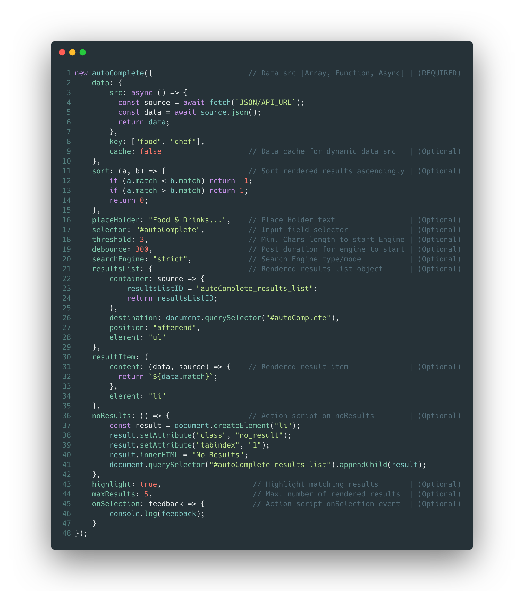

# autoComplete.js :sparkles:

[](https://opensource.org/licenses/Apache-2.0)
[](https://badge.fury.io/gh/tarekraafat%2FautoComplete.js)
[](https://badge.fury.io/js/%40tarekraafat%2Fautocomplete.js)


[](https://bundlephobia.com/package/@tarekraafat/autocomplete.js@latest)

[](https://www.jsdelivr.com/package/npm/@tarekraafat/autocomplete.js)

[](https://github.com/TarekRaafat/autoComplete.js)

<br>
<br>
<p align="center">
	<a href="https://tarekraafat.github.io/autoComplete.js/">
  		
	</a>
</p>
<br>
<br>

> Simple autocomplete pure vanilla Javascript library. :rocket:  <a href="https://tarekraafat.github.io/autoComplete.js/demo/" target="\_blank">Live Demo</a> **v10**

autoComplete.js is a simple, pure vanilla Javascript library progressively designed for speed, high versatility, and seamless integration with a wide range of projects & systems. <sub><sup>(Made for a better developer experience)</sub></pub>

## Features

-  Pure Vanilla Javascript
-  Zero Dependencies
-  Simple & Lightweight
-  Powerful Search Engine with two different modes
-  Diacritics Support
-  Debounce Support
-  Life Cycle Events
-  Useful plugin API
-  WAI-ARIA Compliant
-  Highly Customizable
-  Works on anything <small>(`<input>`, `<textarea>` and `contentEditable` elements)</small>
-  Well Documented

[](https://codepen.io/tarekraafat/pen/rQopdW?editors=0010)

## Getting Started

### Installation:

#### CDN

`JS`

```html
<script src="https://cdn.jsdelivr.net/npm/@tarekraafat/autocomplete.js@10.2.9/dist/autoComplete.min.js"></script>
```

`CSS`

```html
<link rel="stylesheet" href="https://cdn.jsdelivr.net/npm/@tarekraafat/autocomplete.js@10.2.9/dist/css/autoComplete.min.css">
```
#### Package Manager

-   <a href="https://www.npmjs.com/package/@tarekraafat/autocomplete.js">npm</a> install `(Node Package Manager)`

```shell
npm i @tarekraafat/autocomplete.js
```

-   <a href="https://yarn.pm/@tarekraafat/autocomplete.js">Yarn</a> install `(Javascript Package Manager)`

```shell
yarn add @tarekraafat/autocomplete.js
```

<!-- * * * -->

## Documentation:

-   For usage & configuration details check out **autoComplete.js** <a href="https://tarekraafat.github.io/autoComplete.js/">**docs** :notebook_with_decorative_cover:</a>

<!-- * * * -->

## Community Plugins:

-   [Contao autoComplete.js Bundle](https://github.com/heimrichhannot/contao-autocompletejs-bundle) by [@heimrichhannot](https://github.com/heimrichhannot)

* * *

## Support

Technical questions and support, please post your question on Stack Overflow using the below tag

- Stack Overflow [autoCompletejs][stackOverflow]


General questions or new ideas for `autoComplete.js` please start a discussion on Github using the below link

- Github [Discussions]

<!-- section links -->
[Discussions]: https://github.com/TarekRaafat/autoComplete.js/discussions
[stackoverflow]: https://stackoverflow.com/questions/tagged/autoCompletejs

* * *

## Author

**Tarek Raafat**

-   Email: tarek.m.raafat@gmail.com
-   Website: [tarekraafat.com](http://www.tarekraafat.com/)
-   Github: [github.com/TarekRaafat](https://github.com/TarekRaafat/)

* * *

## License

Released under the [Apache 2.0 license](https://www.apache.org/licenses/LICENSE-2.0).

© 2022 [Tarek Raafat](http://www.tarekraafat.com)
