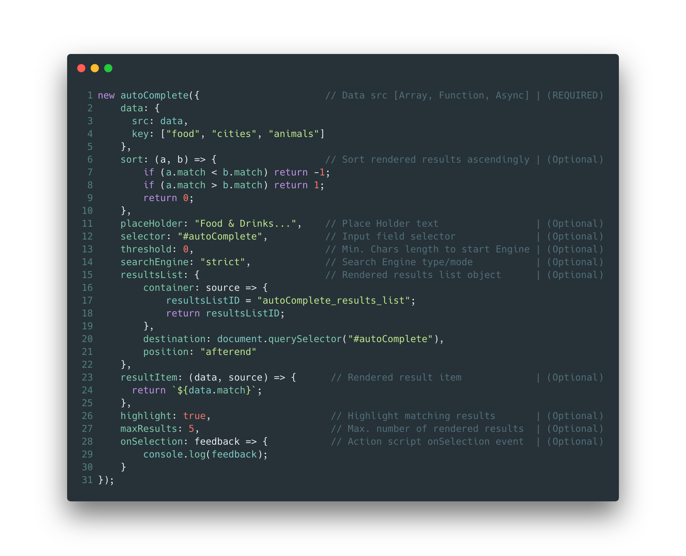

# autoComplete.js :sparkles:

[](https://opensource.org/licenses/Apache-2.0)
[](https://travis-ci.com/TarekRaafat/autoComplete.js)
[](https://badge.fury.io/gh/tarekraafat%2FautoComplete.js)
[](https://badge.fury.io/js/%40tarekraafat%2Fautocomplete.js)
[](https://www.jsdelivr.com/package/gh/TarekRaafat/autoComplete.js)
](https://img.shields.io/badge/Dependencies-0-blue.svg)
](https://img.shields.io/badge/Size-4%20KB-green.svg)
[](https://github.com/TarekRaafat/autoComplete.js)

<br>
<br>
<p align="center">
	<a href="http://www.tarekraafat.com/dev/projects/autoComplete/">
  		
	</a>
</p>
<br>
<br>
<br>
<br>

> Simple autocomplete pure vanilla Javascript library. <a href="http://www.tarekraafat.com/dev/projects/autoComplete/" target="\_blank">Live Demo</a>

autoComplete.js is a simple pure vanilla Javascript library that's designed for speed, high versatility and seamless integration with wide range of projects & systems, made for users and developers in mind.

## Features

-   Simple & Easy to use
-   Pure Vanilla Javascript
-   Zero Dependencies
-   Lightweight
-   Lightning Fast
-   Versatile
-   Customizable
-   First Class Error Handling & Reporting

## [](https://codepen.io/tarekraafat/pen/rQopdW)

## Get Started

### Clone:

-   Clone autoComplete.js to your local machine using

```shell
git clone https://github.com/TarekRaafat/autoComplete.js.git
```

### Installation:

#### <a href="https://www.jsdelivr.com/package/gh/TarekRaafat/autoComplete.js?tab=collection">jsDelivr</a> CDN

`CSS`

```html
<link rel="stylesheet" href="https://cdn.jsdelivr.net/gh/TarekRaafat/autoComplete.js@1.5.0/dist/css/autoComplete.min.css"/>
```

`JS`

```html
<script src="https://cdn.jsdelivr.net/gh/TarekRaafat/autoComplete.js@1.5.0/dist/js/autoComplete.min.js"></script>
```

#### <a href="https://www.npmjs.com/package/@tarekraafat/autocomplete.js">npm</a> install `(Node Package Manager)`

```shell
npm i @tarekraafat/autocomplete.js
```

<!-- * * * -->

## Documentation:

-   autoComplete.js <a href="#">docs</a>

* * *

## Support

For general questions about autoComplete.js, tweet at [@TarekRaafat].

For technical questions, you should post a question on [Stack Overflow] and tag
it with [autoComplete.js][so tag].

<!-- section links -->

[stack overflow]: http://stackoverflow.com/

[@tarekraafat]: https://twitter.com/TarekRaafat

[so tag]: http://stackoverflow.com/questions/tagged/autoComplete.js

* * *

## Author

Tarek Raafat - tarek.m.raafat@gmail.com

Distributed under the Apache 2.0 license. See `Apache 2.0` for more information.

<https://github.com/TarekRaafat/>

* * *

## License

Apache 2.0 © [Tarek Raafat](http://www.tarekraafat.com)
