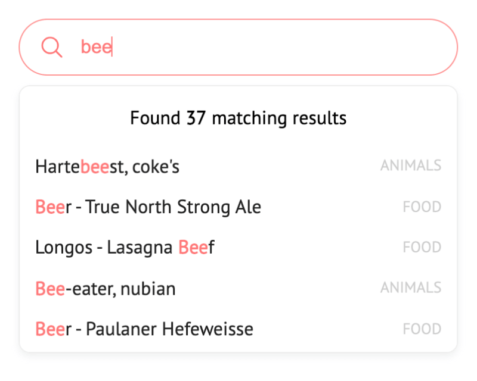
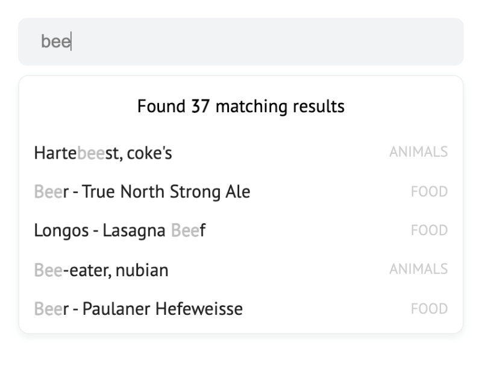
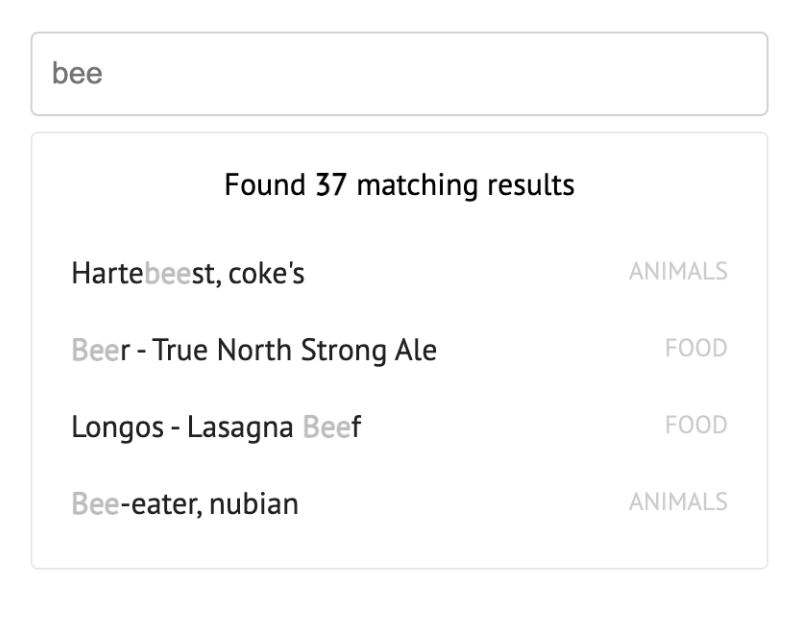

# Styles <!-- {docsify-ignore} -->

Different styles for autoComplete.js

***

<!-- panels:start -->
<!-- div:left-panel -->
`Default style`

```html
<link rel="stylesheet" href="https://cdn.jsdelivr.net/npm/@tarekraafat/autocomplete.js@{{version}}/dist/css/autoComplete.min.css">
```
<!-- div:right-panel -->

<!-- panels:end -->

***

<!-- panels:start -->
<!-- div:left-panel -->
`Style 01`

```html
<link rel="stylesheet" href="https://cdn.jsdelivr.net/npm/@tarekraafat/autocomplete.js@{{version}}/dist/css/autoComplete.01.min.css">
```
<!-- div:right-panel -->

<!-- panels:end -->

***

<!-- panels:start -->
<!-- div:left-panel -->
`Style 02`

```html
<link rel="stylesheet" href="https://cdn.jsdelivr.net/npm/@tarekraafat/autocomplete.js@{{version}}/dist/css/autoComplete.02.min.css">
```
<!-- div:right-panel -->

<!-- panels:end -->
